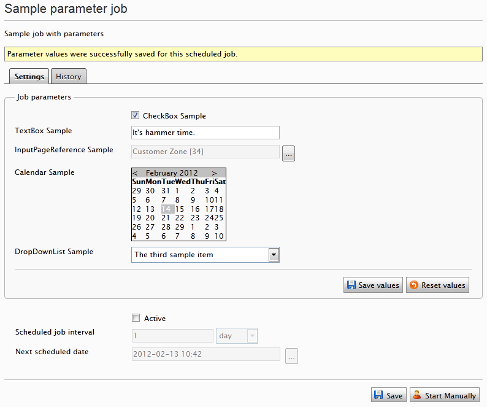

# ScheduledParameterJob for Optimizely v.11
Optimizely EPiServer scheduled job with parameters that can be managed in the admin UI.

The original version and the main credit goes to [Mathias Kunto](https://blog.mathiaskunto.com/).
The original [post](https://blog.mathiaskunto.com/2012/02/13/supplying-episerver-scheduled-jobs-with-parameters-through-admin-mode/).  
This version updates the original package to work with Optimizely version 11.

Package available at [nuget.optimizely.com](https://nuget.optimizely.com/package/?id=ScheduledParameterJob.Opitimizely.v11).

## Usage

* Install the nuget package available at [nuget.optimizely.com](https://nuget.optimizely.com/package/?id=ScheduledParameterJob.Opitimizely.v11)
* Create a class that has the Parameters and it inherits `IParameterDefinitions`. [Example](ScheduledParameterJob/ExampleJob/DefinitionSample.cs)
* Create a Scheduled job with the attribute `ScheduledPlugInWithParameters`, set *DefinitionsClass* and *DefinitionsAssembly*. [Example](ScheduledParameterJob/ExampleJob/SampleParameterJob.cs)
* (Optional) read the original [blog post](https://blog.mathiaskunto.com/2012/02/13/supplying-episerver-scheduled-jobs-with-parameters-through-admin-mode/) from Mathias

### Changelog
[Changelog](ScheduledParameterJob.Package/docs/readme.md)
